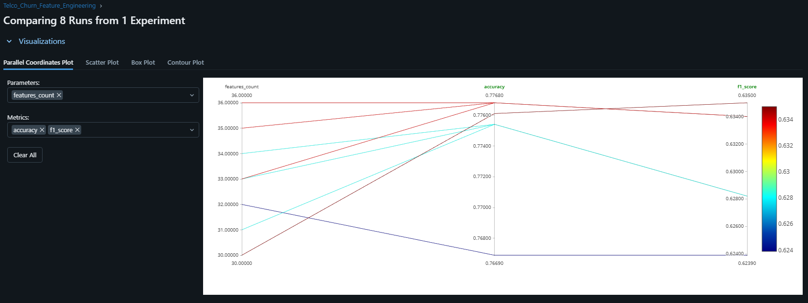
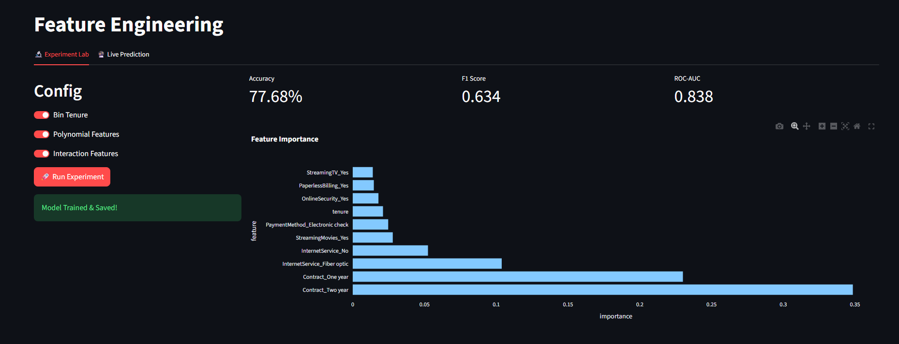
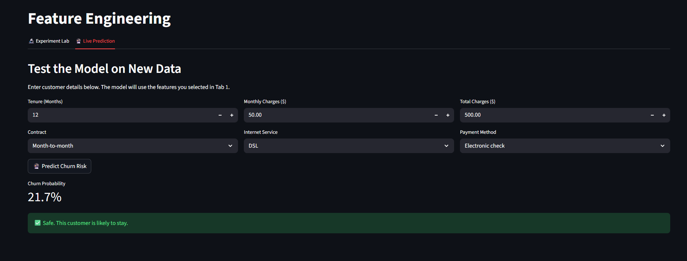

Here is the **entire README.md**, **one single continuous Markdown file**, from top to bottom.
You can **copy-paste this exactly** and save it as `README.md`.
There is **nothing outside this file**.

---

````markdown
# 🧪 Feature Engineering Playground

### *A Microservices-based ML Application for Churn Prediction*


---

## 📌 Project Overview

This project demonstrates the **Data-Centric AI** philosophy.  
Instead of repeatedly changing machine learning algorithms, the model (**XGBoost**) is kept fixed while performance is improved through **systematic feature engineering** and **cost-sensitive learning**.

The system follows a **Microservices-lite architecture**:
- **Backend:** FastAPI (ML inference & logic)
- **Frontend:** Streamlit (Interactive dashboard)
- **Experiment Tracking:** MLflow (Metrics, parameters, artifacts)

---

## 📸 Experiment Results & Insights

### 1️⃣ Feature Strategy Analysis (Parallel Coordinates)

*Visualizing how feature count and class-weight tuning impact the F1 score.*



**Key Insight — Curse of Dimensionality**

The highest F1 score (~**0.635**) was achieved using a **balanced feature set**.  
Enabling all engineered features (Polynomial + Interaction + Binning) caused a slight performance drop (~0.634), showing that adding noisy or redundant features can hurt generalization even in robust models like XGBoost.

---

### 2️⃣ Feature Importance & Model Performance

*Engineered features consistently outperform raw inputs.*



**Performance Summary**
- **Baseline F1:** ~0.58 (Standard XGBoost)
- **Final F1:** ~0.635 (Feature Engineering + Cost-Sensitive Learning)
- **ROC-AUC:** ~0.84

---

### 3️⃣ Live Inference Pipeline

*Trained models are persisted and served for real-time predictions.*



---

## 🏗️ Project Architecture

```text
├── data/               # Raw and processed datasets
├── src/
│   ├── backend/        # FastAPI server (ML inference)
│   ├── frontend/       # Streamlit UI
│   └── core/           # Feature engineering and training logic
├── assets/             # Screenshots and diagrams
├── notebooks/          # EDA and experimentation
└── requirements.txt    # Python dependencies
````

---

## 🚀 Getting Started (Local Setup)

Follow the steps below to run the complete system locally, including the backend API, frontend dashboard, and experiment tracking.

### 1️⃣ Environment Setup

```bash
# Clone the repository
git clone https://github.com/DS-ProjectRepo/feature-playground.git
cd feature-playground

# Create virtual environment
python -m venv venv
source venv/bin/activate        # On Windows: venv\Scripts\activate

# Install dependencies
pip install -r requirements.txt
```

---

### 2️⃣ Run the Application

Run the backend and frontend in **separate terminals**.

**Terminal 1 — Backend (FastAPI)**

```bash
uvicorn src.backend.main:app --reload
```

**Terminal 2 — Frontend (Streamlit)**

```bash
streamlit run src/frontend/app.py
```

---

### 3️⃣ Experiment Tracking (MLflow)

To view experiment history and metrics:

```bash
mlflow ui
```

Open `http://localhost:5000` in your browser.

---

## 🧠 Engineering Concepts Applied

1. **Interaction Features**
   Multiplicative combinations (e.g., `Tenure × MonthlyCharges`) to capture non-linear relationships.

2. **Polynomial Expansion**
   Adds curvature to numeric features to improve expressiveness.

3. **Domain-Driven Binning**
   Converts continuous variables (e.g., tenure) into meaningful cohorts.

4. **Cost-Sensitive Learning**
   Adjusts `scale_pos_weight` in XGBoost to handle class imbalance (~1:3 churn ratio).

5. **Microservices Pattern**
   Decouples inference logic from the user interface using REST APIs.

---

## 📌 Key Takeaway

**Feature quality matters more than model complexity.**
Thoughtful feature engineering and disciplined evaluation consistently outperform aggressive model tuning.

---

## 📄 License

This project is released for educational and research purposes.

```